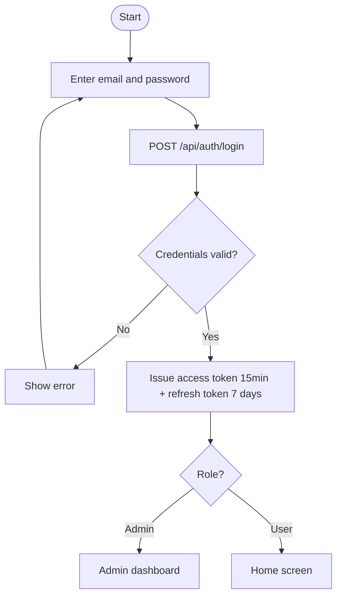
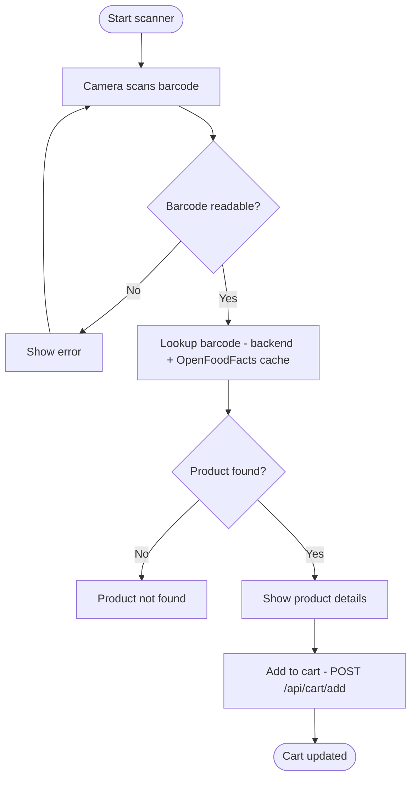
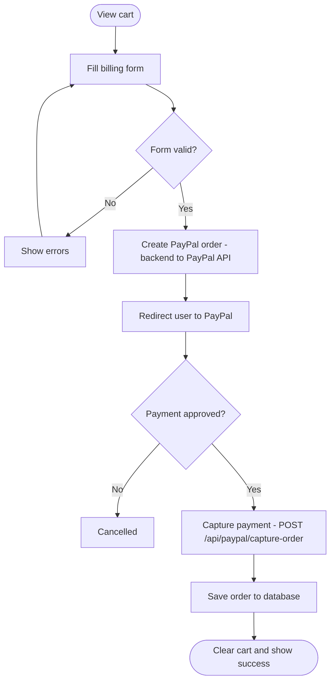
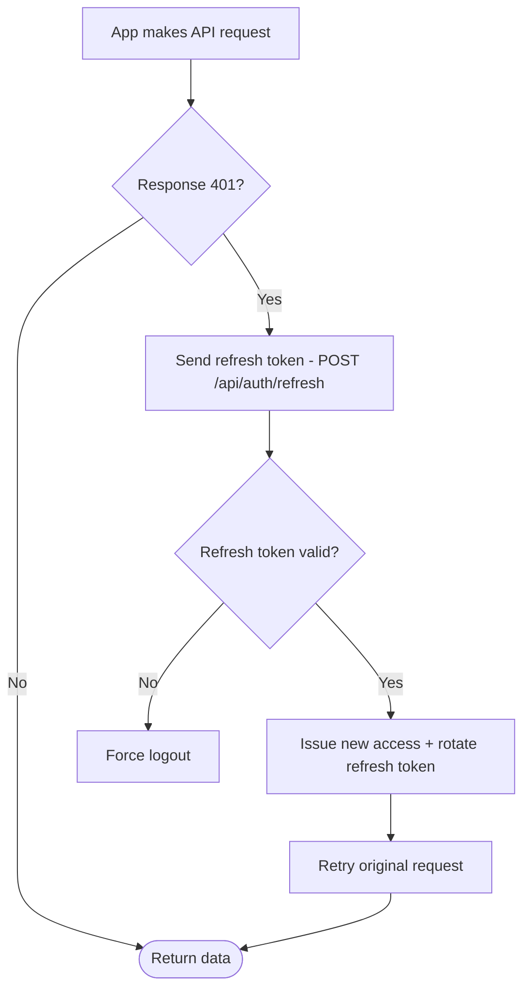
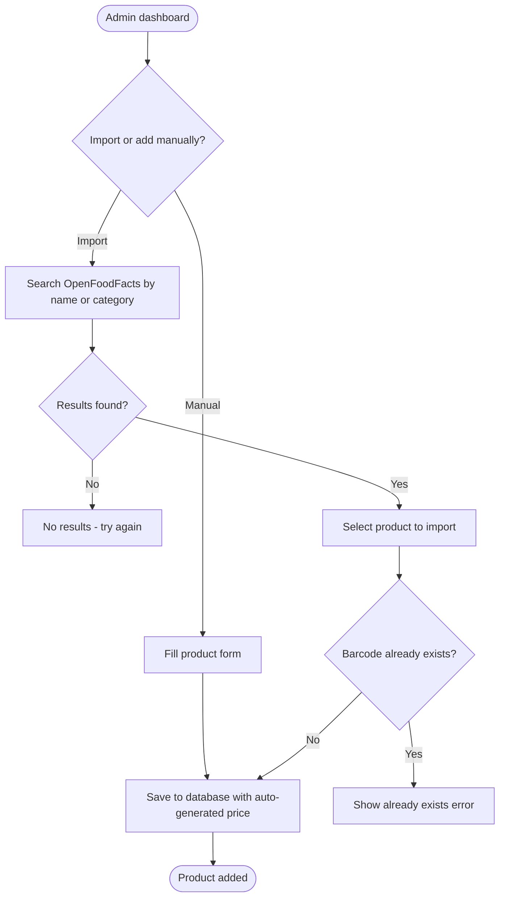
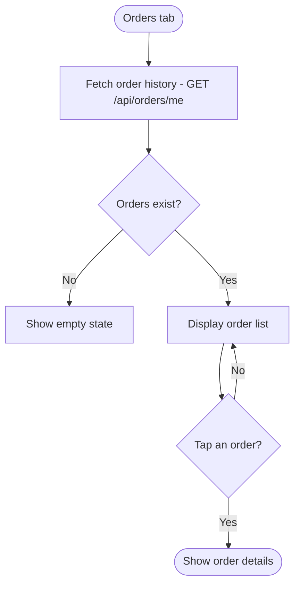
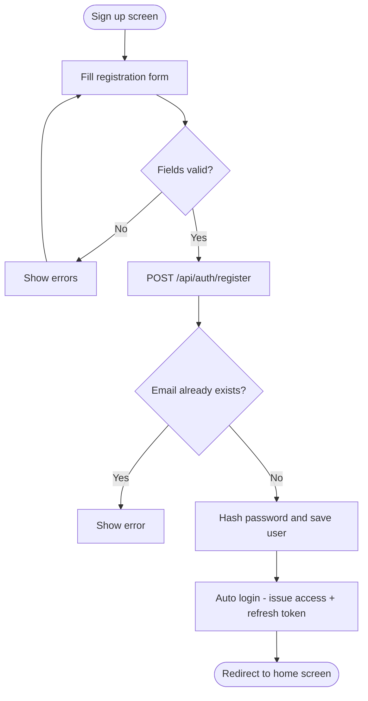

# FreshCart — Activity Diagrams

This document contains all activity diagrams illustrating the key workflows and business processes of the FreshCart mobile application.

---

## 1. User Login Flow

### Description

The login flow begins when the user opens the app and enters their email and password. The credentials are sent to the backend via `POST /api/auth/login`. If invalid, an error is shown and the user can retry. On success, the backend issues a 15-minute JWT access token and a 7-day refresh token. The user is then redirected based on their role — admin to the dashboard, regular users to the home screen.

### Diagram

---

## 2. Barcode Scan to Cart Flow

### Description

The user opens the scanner screen which activates the device camera. The camera processes frames in real time to detect barcodes. If the barcode is unreadable, an error is shown. If readable, the backend looks up the product first in cache, then in OpenFoodFacts if not cached. If found, the product detail screen is shown with name, price, nutritional info, and stock. The user can then add it to their cart via `POST /api/cart/add`.

### Diagram

---

## 3. Checkout and PayPal Payment Flow

### Description

From the cart screen the user proceeds to checkout and fills in billing information including name, address, zip code, and city. If the form is invalid, errors are shown. On valid submission, the backend creates a PayPal order via the PayPal REST API and returns an approval URL. The user is redirected to PayPal to approve the payment. On approval, the backend captures the payment. If cancelled, the flow ends. On successful capture, the order is saved to the database, the cart is cleared, and a success screen is shown.

### Diagram

---

## 4. Token Refresh Flow

### Description

Every API request is sent with a JWT access token. If the server returns a 401 Unauthorized response, the frontend automatically sends the stored refresh token to `POST /api/auth/refresh`. If the refresh token is valid, new access and refresh tokens are issued (rotation) and the original request is retried transparently. If the refresh token is invalid or expired, the user is forced to log out.

### Diagram

---

## 5. Admin Product Import Flow

### Description

The admin can add products manually via a form or import them from OpenFoodFacts by searching by name or category. If no results are found the admin can try a different query. On selecting a product, the system checks if a product with the same barcode already exists in the database. If it does, an error is shown. If not, the product is saved with an auto-generated price based on its category.

### Diagram

---

## 6. Order History Flow

### Description

The user navigates to the Orders tab which triggers a fetch of their order history via `GET /api/orders/me`. If no orders exist, an empty state is shown. Otherwise the list of orders is displayed with date, items, total, and status. Tapping an order opens the order detail screen.

### Diagram

---

## 7. User Registration Flow

### Description

The user fills in the registration form with their name, email, phone number, and password. If the fields are invalid, errors are shown inline. On valid submission, the backend checks if the email already exists. If it does, an error is shown. If not, the password is hashed with bcrypt and the user is saved. The app then automatically logs the user in and redirects them to the home screen.

### Diagram

