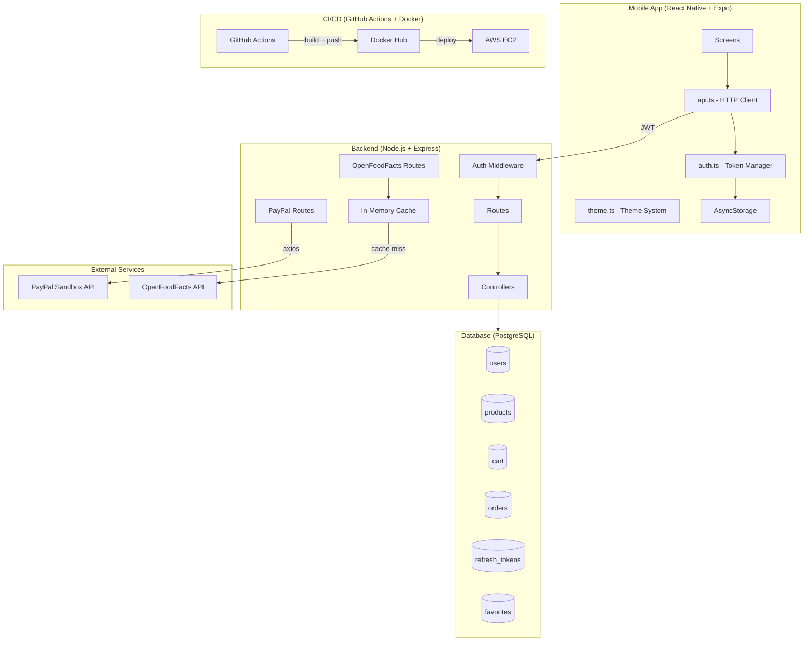
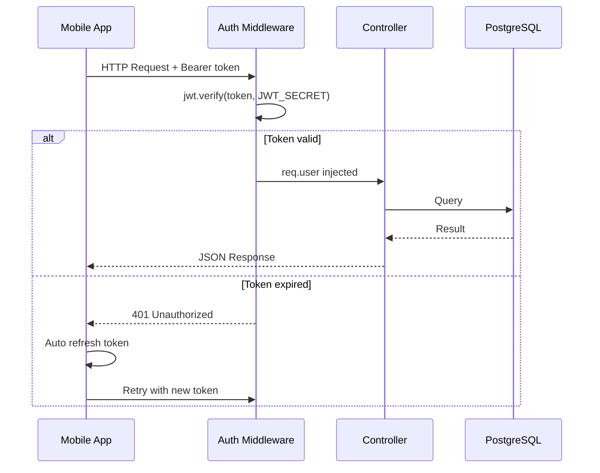

# FreshCart — System Architecture

## Overview

FreshCart follows a client-server architecture with a React Native mobile frontend, a Node.js/Express REST API backend, a PostgreSQL database, and two external services — OpenFoodFacts for product data and PayPal for payments. The entire backend is containerised with Docker and deployed via a GitHub Actions CI/CD pipeline.

---

## Architecture Diagram

---

## Layer Descriptions

### Mobile App

The frontend is built with React Native and Expo, written in TypeScript. It communicates with the backend exclusively through `api.ts`, which handles all HTTP requests, token injection, and automatic token refresh on 401 responses. The theme system supports light, dark, and color-blind modes. All tokens and user data are persisted in AsyncStorage.

### Backend

The Node.js/Express backend follows a layered architecture: routes define the URL structure, middleware handles JWT verification and role-based access, and controllers contain the business logic. The OpenFoodFacts proxy uses an in-memory Map cache with a 24-hour TTL to avoid redundant external calls. PayPal integration uses axios to call the PayPal REST API directly, avoiding the official SDK which is incompatible with Node.js 22.

### Database

PostgreSQL stores all persistent data. The schema includes users, products, cart items, orders, order items, favorites, refresh tokens, and scan events. Refresh tokens are stored in the database to enable server-side revocation.

### External Services

OpenFoodFacts provides free product data by barcode or category search. PayPal Sandbox is used for payment processing — the backend acts as a proxy between the app and the PayPal API to avoid exposing credentials to the client.

### CI/CD

GitHub Actions runs backend and frontend Jest test suites on every push to `dev` or `main`. On success, it builds a Docker image of the backend and pushes it to Docker Hub. The EC2 deployment step is currently disabled.

---

## Request Lifecycle

