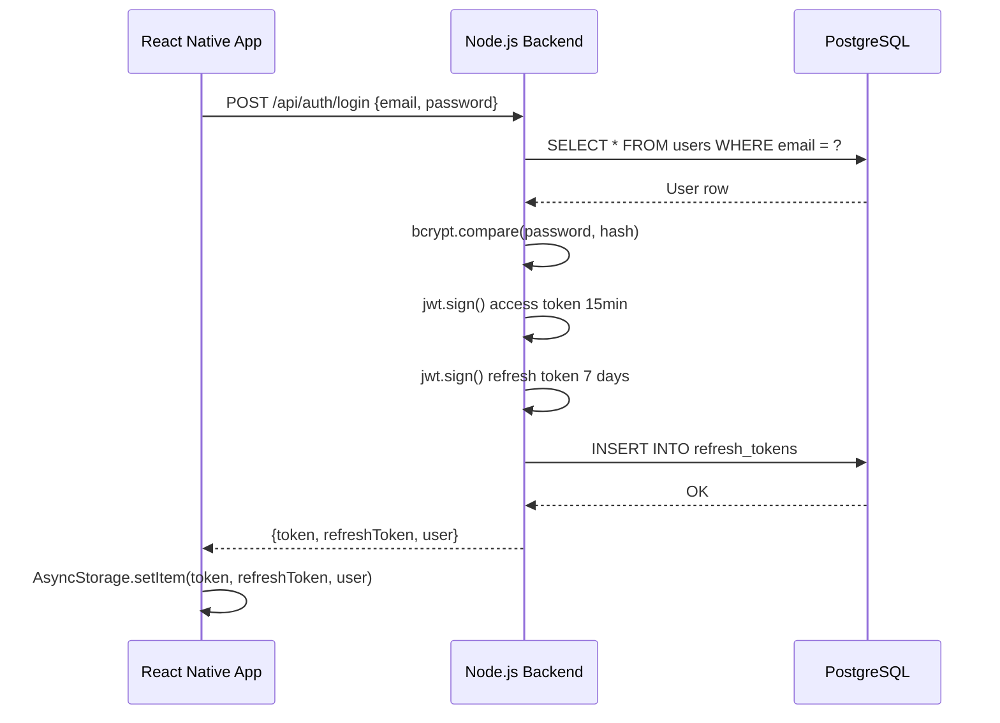
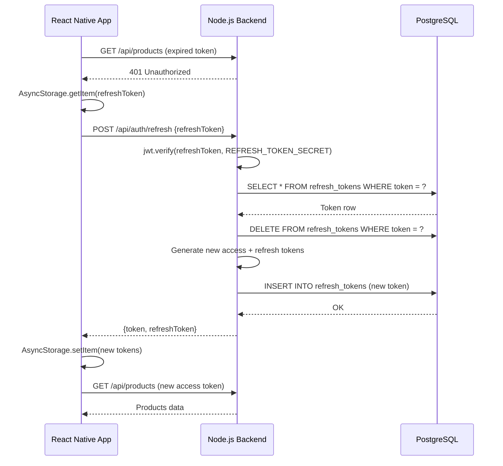
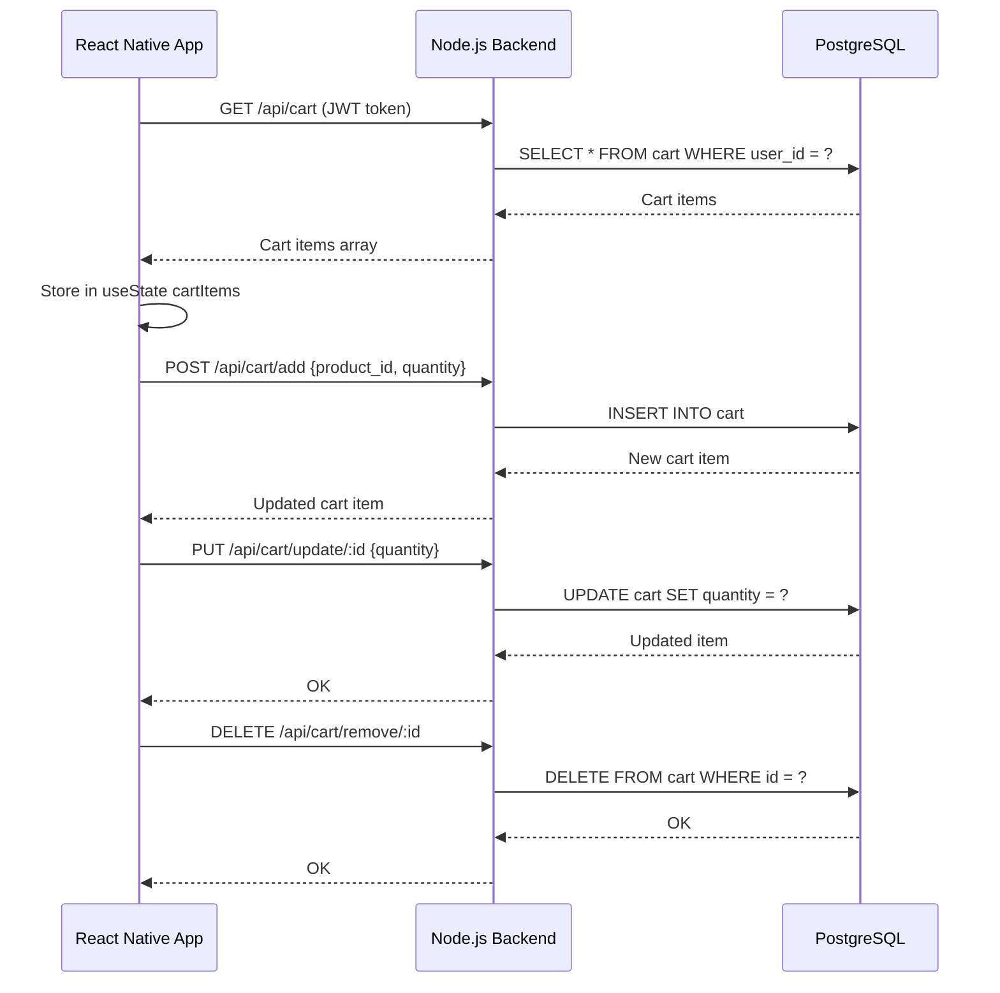
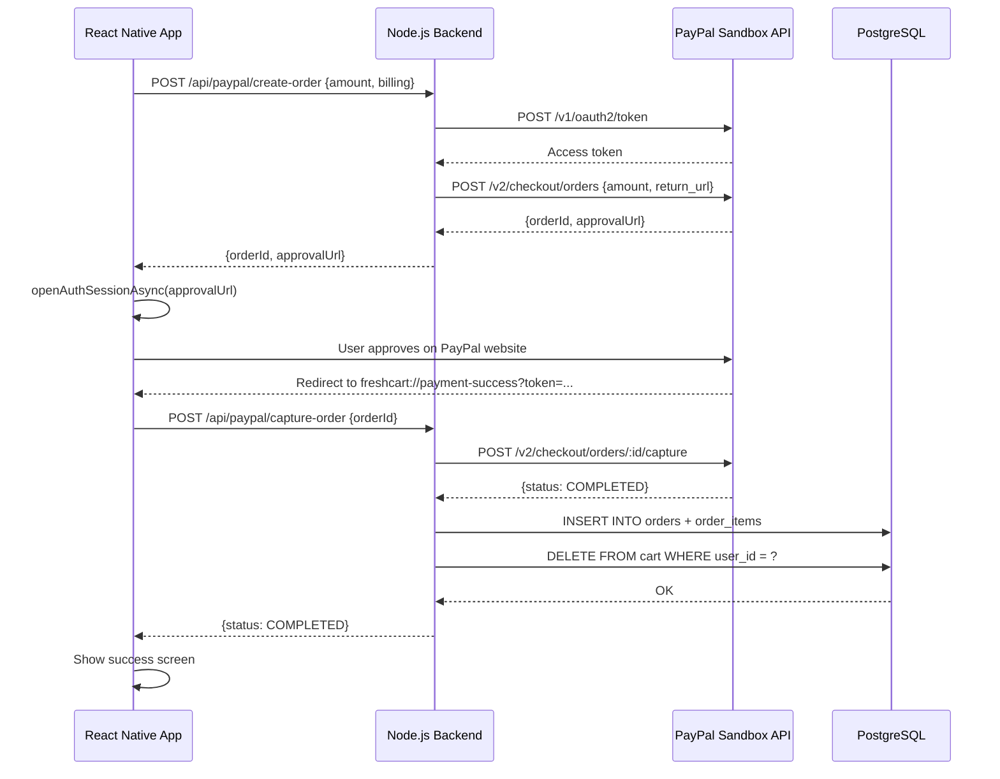
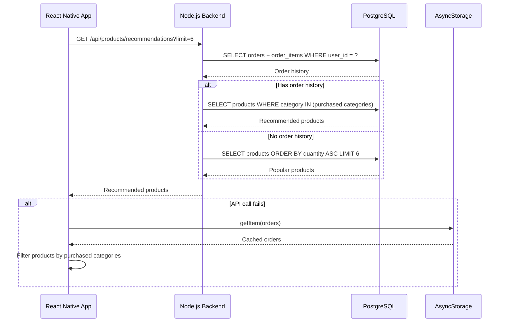

# FreshCart — Data Flows

This document describes how data moves within the FreshCart application, from the mobile frontend through the backend API to the database and external services.

---

## 1. Authentication Data Flow

### Description

When a user logs in, their credentials are sent from the React Native frontend to the Node.js backend over HTTP. The backend queries PostgreSQL to find the user, verifies the password hash using bcrypt, and if valid generates two JWT tokens — a short-lived access token (15 minutes) signed with `JWT_SECRET` and a long-lived refresh token (7 days) signed with `REFRESH_TOKEN_SECRET`. The refresh token is stored in the `refresh_tokens` table in PostgreSQL. Both tokens are returned to the frontend which stores them in AsyncStorage. Subsequent API requests attach the access token in the `Authorization` header.

### Sequence Diagram



---

## 2. Token Refresh Data Flow

### Description

Every API request includes the access token. When the token expires, the backend returns 401. The frontend intercepts this response automatically in `apiRequest`, retrieves the stored refresh token from AsyncStorage, and sends it to `/api/auth/refresh`. The backend verifies the JWT signature using `REFRESH_TOKEN_SECRET`, then checks the token exists in the database (not revoked). If valid, the old refresh token is deleted and new tokens are issued (rotation). The original request is then retried with the new access token.

### Sequence Diagram



---

## 3. Barcode Scan Data Flow

### Description

The user opens the scanner and the Expo Camera processes frames in real time. When a barcode is detected, the barcode string is sent to the backend. The backend first checks its in-memory cache (a Map with 24-hour TTL). If a cached result exists, it is returned immediately. If not, the backend calls the OpenFoodFacts API with a 10-second timeout. The result is cached and returned to the frontend. The frontend displays the product details. If the user taps "Add to Cart", a `POST /api/cart/add` request is sent with the product ID.

### Sequence Diagram

```mermaid
sequenceDiagram
    participant App as React Native App
    participant API as Node.js Backend
    participant Cache as In-Memory Cache
    participant OFF as OpenFoodFacts API
    participant DB as PostgreSQL

    App->>App: Expo Camera detects barcode
    App->>API: GET /api/openfoodfacts/barcode/:barcode
    API->>Cache: getCached(barcode)

    alt Cache hit
        Cache-->>API: Cached product data
    else Cache miss
        API->>OFF: GET /api/v2/product/:barcode
        OFF-->>API: Product data
        API->>Cache: setCache(barcode, data, 24h TTL)
    end

    API-->>App: Product data
    App->>App: Display product details

    App->>API: POST /api/cart/add {product_id, quantity}
    API->>DB: INSERT INTO cart
    DB-->>API: Cart item
    API-->>App: Cart updated
```

---

## 4. Cart Management Data Flow

### Description

Cart state is managed on the backend in PostgreSQL. The frontend fetches the cart on every screen focus using `GET /api/cart`. Adding an item sends `POST /api/cart/add` with the product ID and quantity. Updating a quantity sends `PUT /api/cart/update/:id`. Removing an item sends `DELETE /api/cart/remove/:id`. All operations require a valid JWT access token. The frontend stores cart item IDs and quantities in local React state (`useState`) to render the UI without additional fetches.

### Sequence Diagram



---

## 5. PayPal Payment Data Flow

### Description

The checkout flow starts when the user submits the billing form. The frontend sends the cart total and billing info to the backend. The backend authenticates with PayPal using client credentials (`POST /oauth2/token`) to get a short-lived access token, then creates a PayPal order (`POST /v2/checkout/orders`). PayPal returns an order ID and an approval URL. On mobile, the app opens this URL in the device browser using `expo-web-browser`. The user approves on PayPal's website and is redirected back to the app via the `freshcart://payment-success` deep link. The app extracts the PayPal order ID from the URL and sends a capture request to the backend. The backend calls PayPal's capture endpoint. On success, the order is saved in PostgreSQL and the cart is cleared.

### Sequence Diagram



---

## 6. Product Recommendations Data Flow

### Description

When the home screen loads, it attempts to fetch personalized recommendations from the backend. The backend endpoint looks at the user's order history to identify the categories of products they have purchased before, then returns products from those categories that they have not yet bought. If no order history exists, the most popular products (lowest stock) are returned. If the backend call fails, the frontend falls back to local logic using AsyncStorage order cache, and if that also fails, it displays the first six products alphabetically.

### Sequence Diagram


