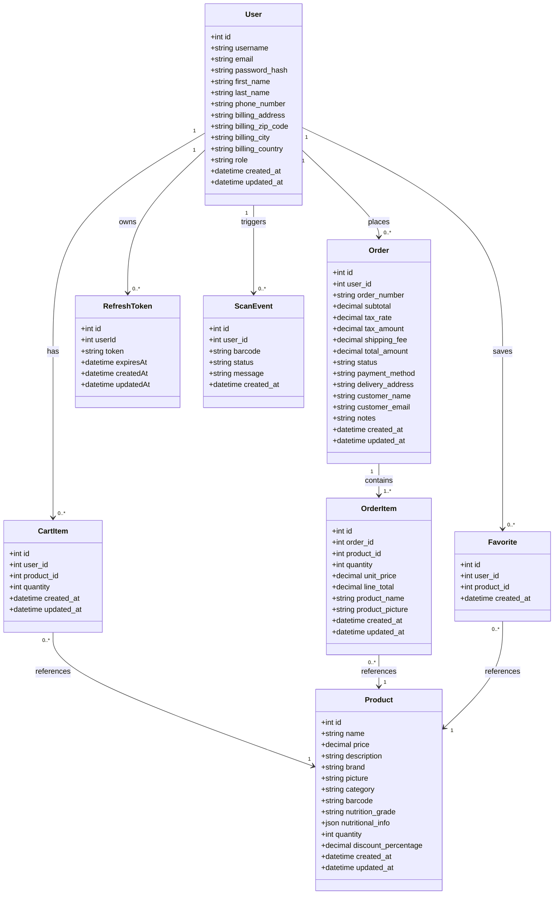

# FreshCart — UML Class Diagram

This document presents the class diagram showing the main data structures of FreshCart and their relationships.

---

## Description

The FreshCart data model is built around a central `User` entity. Each user can have many `CartItem` entries representing their current shopping session, many `Order` records representing their purchase history, many `Favorite` entries for saved products, and many `RefreshToken` entries for JWT session management.

Each `Order` contains many `OrderItem` entries, each linked to a `Product`. Products belong to categories and can have a discount percentage applied. Cart items and order items both reference the `Product` entity directly.

---

## Class Diagram

---

## Relationships Summary

| Relationship | Type | Description |
|---|---|---|
| User → CartItem | One to many | A user has multiple items in their cart |
| User → Order | One to many | A user can place multiple orders |
| User → Favorite | One to many | A user can save multiple favorite products |
| User → RefreshToken | One to many | A user can have multiple active sessions |
| User → ScanEvent | One to many | Each barcode scan is logged per user |
| Order → OrderItem | One to many | Each order contains one or more items |
| CartItem → Product | Many to one | Multiple cart items can reference the same product |
| OrderItem → Product | Many to one | Multiple order items can reference the same product |
| Favorite → Product | Many to one | Multiple users can favorite the same product |
